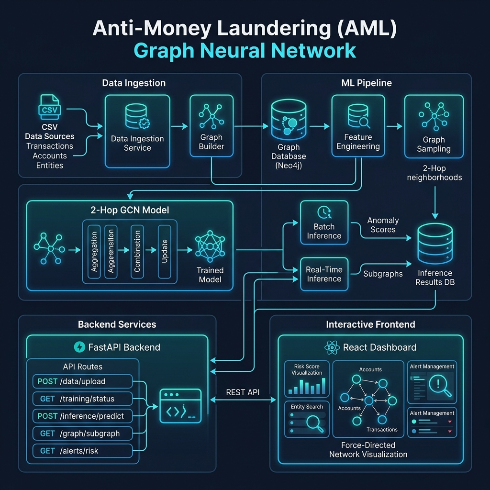
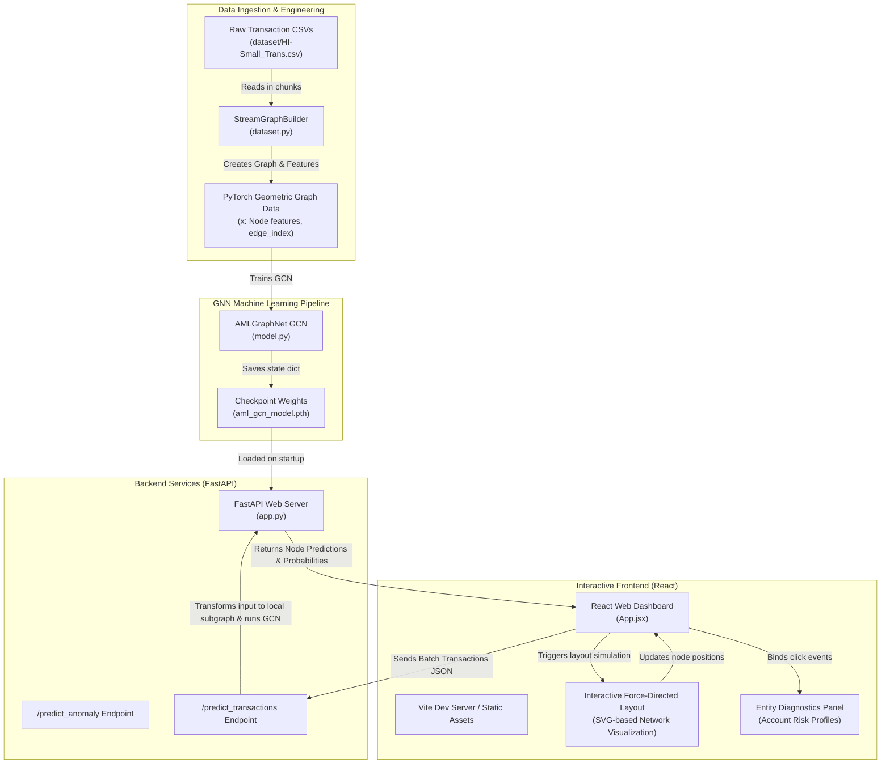

# Anti-Money Laundering (AML) Relational GNN Diagnostics Platform

An interactive, high-throughput, graph-native diagnostics platform designed to identify illicit money laundering activities within financial transaction networks. The system integrates a PyTorch Geometric Graph Convolutional Network (GCN) with a FastAPI high-performance backend and a dynamic force-directed React dashboard.

---

## 🏗️ System Architecture

The application comprises three core components: the GNN model pipeline, the FastAPI REST endpoint, and the React-based visual dashboard.





---

## 🧠 Technical Overview & Deep-Dive

### 1. Relational Graph Convolutional Network ([model.py](model.py))
The core learning engine is standard-built as **`AMLGraphNet`** using PyTorch Geometric:
*   **2-Hop Neighborhood Aggregation**: Two sequential `GCNConv` message-passing layers capture relationships across 2-hop neighborhoods (e.g., Bank A $\rightarrow$ Bank B $\rightarrow$ Bank C). This enables detecting structured loop topologies or distributed fan-out patterns typical of money laundering.
*   **Features Matrix (`x` shape: `[num_nodes, 5]`)**: 
    1.  `log1p(in_degree)`
    2.  `log1p(out_degree)`
    3.  `log1p(amount_sent)`
    4.  `log1p(amount_received)`
    5.  `log1p(total_transaction_count)`
*   **Log-Softmax Classifier**: Outputs log probabilities of binary labels (`Licit` or `Illicit`).
*   **Weighted Loss Minimization**: Employs Negative Log-Likelihood Loss (`NLLLoss`) with inverse frequency class weights to address highly imbalanced real-world financial transaction logs.

### 2. Stream Ingestion Pipeline ([dataset.py](dataset.py))
*   Uses **`StreamGraphBuilder`** to read large-scale raw transaction CSV files in configurable chunk sizes (e.g., 200,000 lines) using pandas.
*   Maintains a persistent registry mapping string/hex transaction account identifiers deterministically to continuous indices.
*   Outputs a unified PyTorch Geometric `Data` structure representing the generated transaction network graph.

### 3. FastAPI Inference Engine ([app.py](app.py))
*   Loads checkpoint weights and the global historical node statistics registry (`node_stats`) on lifespan startup.
*   Hosts two inference routes:
    *   `/predict_anomaly`: Accepts low-level pre-processed tensors (`x` and `edge_index`).
    *   `/predict_transactions`: Accepts streaming batch JSON transaction packets, builds a local subgraph on the fly, combines local batch statistics with historical global statistics (to prevent training-to-serving feature distribution shifts), runs 2-hop GCN inference, and returns account risk predictions.

### 4. Interactive Client Console ([App.jsx](frontend/src/App.jsx))
*   Built using **React** and **Vite**.
*   Implements a custom **Force-Directed Layout Engine** using custom spring attractions and repulsion gravity to spread nodes dynamically in real time.
*   Provides telemetry metrics (GCN probabilities, Transaction Outflow/Inflow, Bank IDs) in a responsive panel.

---

## ⚙️ Commands to Run the Project

### 1. Environment Installation

#### Backend (Python 3.10+)
```bash
# Initialize and activate virtual environment
python -m venv venv
# On Windows PowerShell:
.\venv\Scripts\Activate.ps1

# Install CPU PyTorch to keep installation footprints minimal
pip install torch --index-url https://download.pytorch.org/whl/cpu

# Install additional packages
pip install -r requirements.txt
```

#### Frontend (Node.js)
```bash
cd frontend
npm install
cd ..
```

---

### 2. Model Training

Train the model and save weight checkpoints using [train.py](train.py):

```bash
# Run a quick training loop (100k rows, 5 epochs) to generate aml_gcn_model.pth
python train.py --max_rows 100000 --epochs 5 --save_path aml_gcn_model.pth --cpu

# Run a full training loop on custom datasets
python train.py --data_path "dataset/HI-Small_Trans.csv" --epochs 20 --lr 0.01 --hidden_channels 64 --dropout 0.3 --save_path aml_gcn_model.pth
```

---

### 3. Running Services (Local Development)

#### Spin up FastAPI Backend
Starts backend locally listening on `http://127.0.0.1:8000`:
```bash
python app.py
```

#### Spin up React Frontend Dev Server
Starts the hot-reloading frontend on `http://localhost:5173`:
```bash
cd frontend
npm run dev
```

---

### 4. Unified Static Production Serve

To package the frontend app and serve it directly via FastAPI (served from `http://127.0.0.1:8000/` without needing Vite dev server):

```bash
# 1. Build the production files
cd frontend
npm run build
cd ..

# 2. Run the server
python app.py
```

---

### 5. Running Integration Tests

Validate backend services, training exports, and REST APIs by executing the test pipeline:
```bash
python test_pipeline.py
```

---

### 6. Containerization (Docker Compose)

The backend service is containerized using [Dockerfile](Dockerfile) and [docker-compose.yml](docker-compose.yml):

```bash
# Build the Docker image
docker build -t aml-gnn-pipeline .

# Spin up the containers (maps port 8000 and mounts aml_gcn_model.pth)
docker-compose up -d

# View service logs
docker-compose logs -f

# Spin down services
docker-compose down
```
