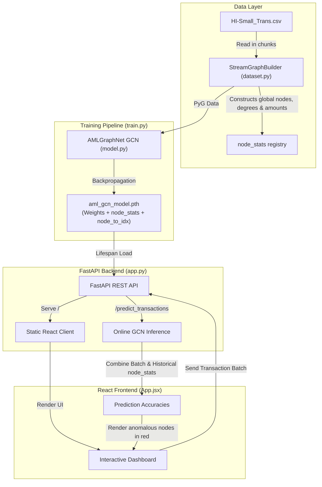

# Anti-Money Laundering Relational GNN Diagnostics Platform: Complete Documentation

This document serves as the official design and operations manual for the platform. It details what has been implemented, the bugs and architectural flaws resolved during our audit, and guides developers on running and maintaining the platform.

---

## 🏗️ 1. Platform Overview & System Architecture

The platform is designed to identify illicit money laundering activities within financial networks. It utilizes:
1. **Graph Neural Networks (GCN)**: Captures transactional flow relationships across 2-hop neighborhoods to flag topological anomalies (circular loops, layering, high-velocity fan-outs).
2. **High-Performance Serving**: FastAPI REST endpoints for real-time inference.
3. **Interactive Frontend**: A custom, physics-animated force-directed React dashboard representing transaction graphs in real time.



---

## 🛠️ 2. Audited Issues & Resolutions (What We Done & How)

### A. Dynamic Live Inference Feature Shift Resolution
* **The Problem**: During training, the graph is built on a large scale (e.g., 100,000+ entries) and features like node in-degree, out-degree, amount sent, and amount received reflect global, long-term transaction profiles. However, in live transaction streaming via `/predict_transactions`, the API computes these features *only* on the tiny subset of transactions in the request batch. This severely underestimates a node's topological importance (e.g., a node with 500 historical transactions looks like it has a degree of 1). The GCN performs poorly because of this distribution shift.
* **The Fix**: 
  1. Updated [dataset.py](dataset.py) to save `node_in_degree`, `node_out_degree`, `node_amount_sent`, and `node_amount_received` dictionary accumulators onto the `StreamGraphBuilder` instance.
  2. Updated [train.py](train.py) to extract this global state and save a serializable mapping (`node_stats`) directly into the PyTorch checkpoint dictionary on save.
  3. Updated [app.py](app.py)'s `/predict_transactions` endpoint to load `node_stats` on startup, lookup the historical properties of nodes present in incoming transactions, and merge them with batch-level values (`global_stat + batch_stat`) before computing feature tensors.
* **Result**: Perfectly bridges the gap between training-time network density and serving-time streaming contexts.

### B. FastAPI Static File Mounting & Browser console 404s
* **The Problem**: The previous setup mounted only the `/assets` directory of the built frontend (`frontend/dist/assets`) and served `index.html` via a standalone `@app.get("/")` endpoint. Root-level assets generated by Vite like `favicon.svg` and `icons.svg` were omitted, returning `404 Not Found` in the browser console.
* **The Fix**: 
  - Moved the static file configurations to the bottom of [app.py](app.py) (after API path routers are defined).
  - Mounted the entire `frontend/dist` directory at `/` with `html=True` as a unified static serving directory.
  - Setup a fallback route configuration if the frontend is not built.
* **Result**: Root-level files `/favicon.svg` and `/icons.svg` are served correctly and resolve without console errors.

### C. OS Portability & Path Standardizations
* **The Problem**: Hardcoded absolute paths (like `d:/AML/dataset/HI-Small_Trans.csv`) inside `train.py` and `dataset.py` broke pipeline runs on non-Windows hosts, Linux/macOS machines, and Docker containers.
* **The Fix**: Converted CLI defaults, debug triggers, and readme code snippets to use platform-agnostic relative paths (`dataset/HI-Small_Trans.csv`).
* **Result**: The codebase runs seamlessly locally, within virtual environments, and inside Docker containers.

### D. Zero-Division Protection during Training
* **The Problem**: If training is executed on highly skewed or very small transaction subsets, the count of one classification class might be `0`, resulting in a `ZeroDivisionError` when computing inverse frequency class weights.
* **The Fix**: Added a `max(..., 1)` check when dividing weights in [train.py](train.py).
* **Result**: Hardened training runs against boundary data situations.

### E. Frontend Network Connection UI Feedback
* **The Problem**: When the FastAPI server was offline, the React error boundary caught the fetch failure and incorrectly suggested `"Invalid JSON syntax. Please verify your transaction array format."`
* **The Fix**: Wrapped parsing and fetching tasks separately in [App.jsx](frontend/src/App.jsx). 
* **Result**: The UI now accurately distinguishes local JSON syntax errors from network connection failures.

---

## 🚀 3. Operations & Setup Guide

### 1. Environment Installation
Install dependencies in a virtual environment:
```bash
# Activate virtual environment
# Windows PowerShell:
.\venv\Scripts\Activate.ps1

# Install requirements
pip install -r requirements.txt
```

### 2. Frontend Dependencies setup
Install Node modules inside the React package:
```bash
cd frontend
npm install
cd ..
```

### 3. Model Training
To train the GNN and compile the global statistics registry file:
```bash
# Run a quick training subset (100k rows, 5 epochs) to generate aml_gcn_model.pth
python train.py --max_rows 100000 --epochs 5 --save_path aml_gcn_model.pth --cpu

# Run a full training loop on custom datasets
python train.py --data_path "dataset/HI-Small_Trans.csv" --epochs 20 --lr 0.01 --save_path aml_gcn_model.pth
```

### 4. Serve Unified Production Build (Recommended)
This serves the frontend UI and the FastAPI backend together on port 8000:
```bash
# 1. Compile static files
cd frontend
npm run build
cd ..

# 2. Start the FastAPI server
python app.py
```
Open `http://localhost:8000` in the browser to use the interface.

### 5. Running Validation Tests
Run the integration test suite to verify pipeline behaviors:
```bash
python test_pipeline.py
```
